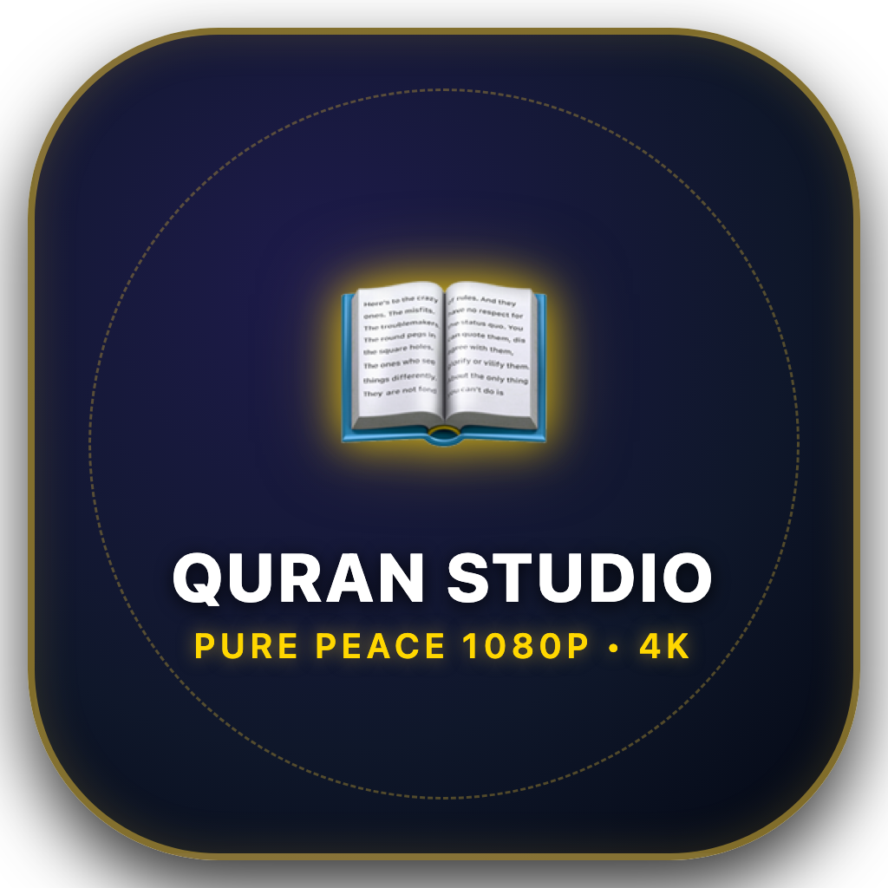

# 🌟 Quran Video Studio (Professional Edition)

<div align="center">



### Automated 4K & 1080p Quran Recitation Video Production Suite
**Full Surah & Ayah Generation • Word-by-Word Synchronization • Dynamic Audio Waveforms • Multi-Language Translations • Sadaqah Jariyah Dedications • YouTube SEO & Metadata Automation**

[](https://github.com/sciencefiction879-cmyk/quran-video-studio/releases)
[](https://github.com/sciencefiction879-cmyk/quran-video-studio/releases)
[](https://github.com/sciencefiction879-cmyk/quran-video-studio/releases)

</div>

---

## 📖 Overview

**Quran Video Studio** is an all-in-one desktop studio and automated rendering engine designed to produce broadcast-quality Holy Quran recitation videos. It features precise word-by-word acoustic synchronization, rich Islamic background templates, 15+ live audio waveforms, customizable translations (Urdu Nastaliq, English, Hindi), and automated YouTube SEO packages with chapter timestamps and SRT subtitles.

---

## ✨ Key Features

- **🚀 Default Surah Hamd (Al-Fatihah) & Smart Settings Memory**:
  - Automatically loads Surah 1 (Al-Fatihah) on launch.
  - Remembers your favorite reciter, translations, speed, fonts, and output folder across sessions.
  - Zero-lag Surah switching across Top Badge, Emerald Cartouche, Verses Drawer, and Qari audio.

- **🎛️ Free Positioning & Nudge Controls**:
  - Drag & drop Tilawat (Arabic), Urdu translation, and English translation anywhere on the canvas.
  - **1-Click Nudge Bar**: Fine adjustments (`⬆️` / `⬇️` ±1.5%) and Fast Jumps (`▲▲` / `▼▼` ±5.0%).
  - Layout presets: *⚖️ Balanced*, *📜 Parchment*, and *⬆️ Top Tilawat*.

- **🌊 15+ Dynamic Audio Waveforms**:
  - Real-time audio frequency visualization.
  - Styles include *Neon Cyberpunk*, *Glowing Quran Aura*, *Golden Sunset*, *Minimal Dots*, *Silk Ribbon*, *Pulsing Heartbeat*, *Circular Halo*, and *Radial Sunburst*.
  - Toolbar 1-click dropdown + full visual preview modal + sidebar color & glow tuning.

- **📜 Sadaqah Jariyah Dedications (ایصالِ ثواب)**:
  - Add dedications for parents (*والدین کے ایصال ثواب کے لیے*), family, or custom names.
  - Styled with Nastaliq typography and customizable positioning.

- **🎙️ World-Class Qaris & Audio DSP Engine**:
  - Reciters: Sheikh Mishary Rashid Alafasy, Sheikh Mahmoud Khalil Al-Husary, Sheikh AbdulBaset AbdulSamad, Sheikh Abdur-Rahman As-Sudais, Sheikh Hani Ar-Rifai, and more.
  - 19-stage Audio DSP: Speed control, pitch shifting, reverb, 432Hz spiritual tuning, atmospheric ASMR rain/night ambient sounds, and -14 LUFS YouTube loudness normalization.

- **⚡ Ultra-Fast 4K UHD & 1080p Export**:
  - Generates 16:9 YouTube Widescreen and 9:16 Shorts / Reels / TikTok formats.
  - Hardware accelerated MP4 rendering with Apple Silicon VideoToolbox and NVENC/CPU fallbacks.
  - Automated YouTube chapter timestamps, `.srt` subtitle files, and SEO descriptions/tags.

---

## 🚀 Quick Download & Installation

### 🍏 macOS (Apple Silicon & Intel)
1. Download **`QuranVideoStudio.dmg`** from the [Latest Release](https://github.com/sciencefiction879-cmyk/quran-video-studio/releases/latest).
2. Open the `.dmg` file and drag **Quran Video Studio** into your **Applications** folder.
3. Launch from Applications or Spotlight.

### 🪟 Windows (11, 10, 8, 7)
1. Download **`Quran Video Studio.exe`** or **`QuranVideoStudio-v1.4.0-Windows-Portable.zip`** from [Latest Release](https://github.com/sciencefiction879-cmyk/quran-video-studio/releases/latest).
2. Double-click `Quran Video Studio.exe` to launch immediately.
3. *Requirements*: Python 3.10+ and Google Chrome or Microsoft Edge.

---

## 🛠️ Running from Source

```bash
# 1. Clone repository
git clone https://github.com/sciencefiction879-cmyk/quran-video-studio.git
cd quran-video-studio

# 2. Start the local Studio backend
python3 server.py 8765

# 3. Open in browser
open http://localhost:8765
```

---

## 📦 Building Releases

- **Build macOS App & DMG**:
  ```bash
  bash mac_app/build_dmg.sh
  ```
- **Build Windows Executable & Portable ZIP**:
  ```bash
  python3 scripts/build_windows_dist.py
  ```

---

## 🤲 Dedication & Sadaqah Jariyah

May Allah accept this effort and make it a continuous source of reward (صدقۂ جاریہ) for everyone involved and for the entire Muslim Ummah.
